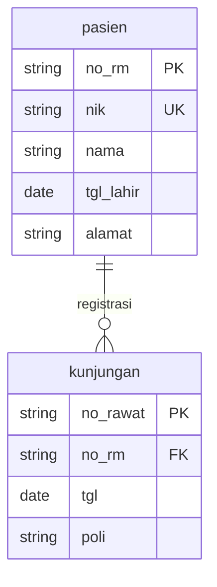

# Dyalisis — Feature-Analysis Visualization Framework

Dyalisis mengubah daftar fitur sebuah aplikasi menjadi **satu file HTML interaktif
mandiri** (tanpa server, tanpa CDN saat runtime). Node aplikasi disusun sebagai
hierarki 4 level dan digambar sebagai *boundary boxes* bergaya C4.

## 1. Apa yang dihasilkan

- `dist/index.html` — SATU file, CSS + JS ter-inline. Buka langsung di browser.
- Graph interaktif: pan/zoom (geser kanvas dari node/compound pun tetap pan,
  node tak bergeser), klik node → sidebar detail + **auto-zoom** yang tetap
  menampilkan 3–4 proses di sekitar (zoom otomatis dibatasi maks 120%),
  seleksi meredupkan elemen tak terkait, toggle level aksi (L3). Toolbar
  sederhana: cari, **Filter multi-select** (beberapa Domain + beberapa Level
  sekaligus, plus Catatan), zoom **+/−**, **Fit all**, ganti layout, tombol
  **Aksi**, dan minimap SVG di pojok.
- **UML class diagram per node** di sidebar: kotak kelas 3 kompartemen
  («stereotype» + nama / atribut dari `fields` / operasi dari anak) + asosiasi
  ke kelas tetangga berlabel field penghubung. SVG inline, theme-aware, tanpa
  dependency baru. Pratinjau kecil bisa **diklik → modal perbesar** (portal ke
  `<body>`, tutup via klik luar / Esc).

Model data = dekomposisi fungsional 4 tingkat:

| Level | Nama | Contoh | Peran di graph |
|---|---|---|---|
| L0 | Aplikasi | Acme Ops | root, parent tertinggi |
| L1 | Modul | Penjualan | compound box |
| L2 | Fitur | Pesanan | leaf (atau parent L3) |
| L3 | Aksi | Buat Pesanan | leaf kecil berlabel |

Tiap level diturunkan dari level di atasnya (parent/child → compound node).

## 2. Struktur repo

```
dyalisis/
├── bin/dyalisis.mjs       # CLI: init / build / test / serve / publish / delete / login / list
├── build.mjs              # bundler engine+content → dist/index.html + dist/graph.json (juga library)
├── lib/
│   ├── scaffold.mjs       # scaffolder proyek content (`dyalisis init`)
│   ├── spec.mjs           # parser spec Markdown 4-aksis → content (`build --spec`)
│   ├── patch-elk.mjs      # patch bug upstream cytoscape-elk (lazy, lihat §7)
│   ├── graph-tools.mjs    # tool graf MCP (murni; stdio + HTTP share implementasi)
│   ├── graph-md.mjs       # proyeksi MD / llms.txt dari graph
│   ├── mcp.mjs            # server MCP stdio (JSON-RPC 2.0)
│   └── publish.mjs        # klien publish/delete/login/list
├── server/
│   └── publish-server.mjs # server penerbit zero-dep (HTML+graph, endpoint AI-friendly)
├── template.html          # shell HTML (placeholder CSS/JS/title)
├── tailwind.config.js
├── package.json           # bin, files, engines, deps (build/test via bin)
├── src/
│   ├── index.jsx          # React app: data → elemen cytoscape, toolbar/filter, sidebar
│   ├── styles.css         # Tailwind + CSS vars shadcn (tema dark)
│   ├── components/        # GraphCanvas + ErdDiagram + UmlDiagram + Minimap + AiPanel + DocsPanel + InsightPanel + Legend + ui/*
│   ├── lib/
│   │   ├── layouts.js     # preset layout + applyLayout()
│   │   ├── navigation.js  # collapseGraph / revealNode (auto-zoom) / syncElements
│   │   ├── flow.js        # buildActivePath() untuk Mode Alur
│   │   ├── graph-style.js # buildGraphStyle(theme, reducedMotion) + graphPalette
│   │   ├── erd.js         # parser erDiagram (isomorphic: Node parser + browser)
│   │   └── analysis.js    # god nodes/coupling/isolated/provenance (build+UI+MCP)
│   └── data/
│       └── example.js     # CONTENT demo generik (di-ship bersama framework)
└── test/
    ├── run.mjs            # self-test headless (80 check: integritas, compound, layout, flow, spec, navigation)
    ├── publish.mjs        # self-test server publish + endpoint AI-friendly (45 check)
    ├── mcp.mjs            # self-test server MCP stdio
    └── browser.mjs        # regresi browser (Playwright-core + Chrome headless)
```

**Engine vs content terpisah total.** Engine (semua kecuali content) tidak tahu
aplikasi apa pun. Paket ini read-only: content proyek pemakai
(`./dyalisis.content.js`) di-alias lewat esbuild (`@dyalisis/content`) saat build,
jadi tidak ada file generated yang ditulis ke `node_modules`.

## 3. Quickstart

Dipakai sebagai framework npm — scaffold proyek content baru:

```bash
npx dyalisis init aplikasi-saya   # folder proyek + dyalisis.content.js (stub)
cd aplikasi-saya
npm install
npx dyalisis test                 # 80 self-check headless → semua PASS
npx dyalisis build                # → dist/index.html + dist/graph.json
```

Untuk aplikasi nyata, cukup sunting `dyalisis.content.js` lalu ulangi
`test` → `build`. `--content <file>` dan `--out <file>` bisa dipakai untuk
menunjuk file/lokasi lain (default: `./dyalisis.content.js` dan `dist/index.html`).

**Dari spec Markdown (opsional).** Bila fitur sudah terdokumentasi sebagai spec
4-aksis (Brief/Goals/Workflow/Entity + blok `erDiagram`), lewati scaffold dan
bangun langsung dari folder spec — parser (`lib/spec.mjs`) memetakannya ke
kontrak di build time:

```bash
npx dyalisis build --spec ./feature-analysis/spec            # → dist/index.html
npx dyalisis build --spec ./feature-analysis/spec --app-name "SoftMedis"
```

## 4. Kontrak content layer (WAJIB)

Satu modul ES yang mengekspor 11 simbol. Lihat `src/data/example.js` sebagai
template terpendek yang lolos semua test.

```js
export const APP = { name, subtitle };                       // judul + subjudul
export const DOMAINS = {                                     // warna + label per domain
  domainId: { label: 'Penjualan', color: '#22d3ee' }
};
export const ROOT = { id: 'app', label, domain,
  desc, fields, route };                                     // node L0 (tunggal)

export const MODULES = [                                     // L1 — 1 per domain
  { id: 'mod-<domain>', label, domain, desc, fields, route, perm }
];

export const NODES = [                                       // L2 — fitur
  { id, label, domain, desc, fields, route, perm,
    entity }                                                 // entity = nama class UML (opsional)
];

export const ACTIONS = [                                     // L3 — aksi/route
  { id, label, parent: <idFitur>, domain }
];

export const EDGES = [                                       // hierarki (opsional dipakai UI)
  ['app', 'mod-x', 'modul'], ['mod-x', 'fitur-x', 'fitur'], ['fitur-x', 'fitur-x~0', 'aksi']
];

export const DATA_EDGES = [                                  // relasi data antar-fitur (berlabel)
  ['fiturA', 'fiturB', 'field_kunci']
];

export const LEVELS = { 0:[...], 1:[...], 2:[...], 3:[...] }; // id per level (untuk levelOf)
export const LEVEL_NAMES = { 0:'Aplikasi', 1:'Modul', 2:'Fitur', 3:'Aksi' };
export const levelOf = (id) => { /* 0..3 */ };
```

**Simbol opsional (memperkaya panel Dokumentasi):**

```js
export const DECISIONS = [{ title, status, context, decision }]; // ADR (arc42 §9)
export const ARC42     = [{ no: 2, body: '...' }];               // override narasi seksi arc42 (1–12)
export const GLOSSARY  = [{ term, definition }];                 // glosarium (arc42 §12)
export const DOCS      = [{ kind: 'How-to', items: ['...'] }];   // artefak Diátaxis (menimpa turunan)
export const NOTES     = { idNode: 'catatan kritis...' };        // catatan per node
// Nilai NOTES boleh string (provenance 'spec') atau { text, provenance } dengan
// provenance 'spec' (berdasar dokumen) | 'inferred' (hasil simpulan).
```

**Field opsional hasil ingest spec (seksi Spesifikasi sidebar):**

```js
// Modul boleh membawa: erd (sumber `erDiagram`) + spec (prosa intro modul).
// Fitur boleh membawa:
//   brief, goals, workflow  — ringkasan sumbu 4-aksis
//   entities                — [{ name, attrs:[{ type, name, key, note }] }]
//   sources                 — ['APP:path', ...] dari feature-registry.md
//   evidence                — PROVEN | OBSERVED | REFERENCED | PROPOSED
//   status                  — teks status bebas
```

Semua field ini opsional dan diabaikan bila kosong, jadi content manual apa pun
tetap valid. Field yang ada ikut terserialisasi ke `dist/graph.json` dan balasan
MCP (`get_node`) lewat helper `specFields()` di `src/lib/analysis.js`.
ERD (`erDiagram`) digambar `ErdDiagram.jsx` sebagai SVG inline
(theme-aware, tanpa dependency) — renderer memakai parser isomorphic
`src/lib/erd.js` yang sama dengan `lib/spec.mjs`.

**Aturan struktur yang diuji `npm test` (80 check):**
- `id` unik di seluruh node.
- `parent` tiap node merujuk id yang ada; **tanpa siklus**.
- `MODULES[i].id` **harus** `mod-<domain>` — engine menurunkan parent fitur dari
  `mod-${node.domain}`, jadi konvensi ini wajib.
- Tiap modul punya ≥1 fitur; tiap fitur punya ≥1 aksi.
- `LEVELS` konsisten dengan panjang `MODULES`/`NODES`/`ACTIONS`; `levelOf` benar.
- Semua `domain` node/aksi terdaftar di `DOMAINS`.
- `DATA_EDGES` kedua ujungnya menunjuk node nyata; kunci `NOTES` menunjuk node nyata.
- `buildActivePath()` (jalur Alur) menguji langsung fungsi engine: langkah pertama
  = start, tiap langkah terhubung `DATA_EDGES`, tanpa node berulang, selektif
  (bukan seluruh graph), `branches` memuat semua successor, dan `branchChoice`
  benar-benar mengubah cabang.
- Bahasa visual diuji lewat resolusi selector cytoscape: `node.flow` border =
  `highlight`, `node.anchor` menang atas `flow`, `edge.chain` lebih tebal dari
  edge biasa, `node.noted` memakai badge dot SVG `noteColor` di sudut kanan-atas.
- Analisis graf (`src/lib/analysis.js`) menguji turunan dari data: `buildModel`
  jumlah node cocok content, sigma derajat = 2×edge data, `godNodes` urut menurun
  & hanya fitur, `crossModuleLinks` selalu lintas domain, `isolatedFeatures` tak
  tersentuh `DATA_EDGES`, `toGraphJson` serializable, dan provenance `noteInfo`
  ternormalisasi ke `{ text, provenance }` (spec|inferred).

**UML class diagram (otomatis dari data):** komponen `UmlDiagram.jsx` mengubah
`fields` (CSV) jadi atribut kelas, anak node jadi operasi, dan `DATA_EDGES` yang
menyentuh node jadi asosiasi berlabel field. `entity` (opsional) menamai kelas;
tanpa itu dipakai `label`. Tipe atribut ditebak dari pola nama (ref/date/number/
string). Tidak perlu konfigurasi tambahan.

**Panel Dokumentasi (`DocsPanel.jsx`):** dibuka dari ikon buku di header. Menyusun
empat perspektif arsitektur — **seluruhnya content-agnostic**: nilai default
dihitung dari data, lalu content boleh menimpa lewat simbol opsional.

- **C4 Model** — pemetaan L0–L3 → Context/Container/Component/Code + jumlah node.
- **arc42** — **12 seksi lengkap** (Intro & Goals, Constraints, Context & Scope,
  Solution Strategy, Building Blocks, Runtime View, Deployment, Crosscutting,
  Decisions, Quality, Risks & Debt, Glossary). Tiap seksi punya ringkasan turunan
  dari data; content dapat menimpanya lewat `ARC42: [{ no, body }]` (nomor seksi 1–12).
- **ADR** — dari array opsional `DECISIONS`: `{ title, status, context, decision }`
  dengan `status` salah satu dari `proposed|accepted|rejected|deprecated`.
- **Glosarium** — dari array opsional `GLOSSARY`: `{ term, definition }` (tampil di
  seksi tersendiri + mengisi arc42 §12).
- **Diátaxis** — empat jenis dokumen (Tutorial/How-to/Reference/Explanation) dengan
  **artefak nyata** diturunkan dari data (modul awal, fitur+route, katalog field,
  relasi data); content dapat menimpanya lewat `DOCS: [{ kind, items }]`.

**Mode Alur:** tombol "Alur" di kanan-bawah kanvas menyorot **satu jalur aktif**
dari fitur terpilih menuju hilir. `buildActivePath()` (src/lib/flow.js) sengaja
tidak menyorot seluruh sub-grafik: pada graph kecil, seluruh node hulu+hilir
hampir menyalakan semua node (terukur ~92% pada example.js), sehingga highlight
kehilangan makna. Alih-alih, framework menelusuri satu jalur; di tiap
percabangan beda, sidebar menampilkan pemilih cabang (`⇉ cabang: A | B`) yang
bisa diganti user — pemilihan disimpan di state `branchChoice` dan jalur
dihitung ulang. Titik start (`flowStart`) terpisah dari langkah aktif
(`selectedId`), sehingga mengklik langkah lain hanya memindahkan penanda, bukan
mengubah root jalur. Node di luar jalur tetap redup tapi terlihat, jadi cabang
alternatif tersedia tanpa membanjiri kanvas.

Bahasa visualnya satu warna: node jalur **dan** panah sama-sama memakai warna
`highlight` dari palet tema, jadi jalur terbaca sebagai satu kesatuan — bukan
"panah menyala, node tidak". Kelas yang dipasang (`GraphCanvas.jsx`):

| Kelas | Arti | Penanda visual |
|---|---|---|
| `node.flow` | node ikut jalur Alur | border warna `highlight`, tebal 4, label bold |
| `edge.chain` | edge **antar-langkah berurutan** di jalur aktif | tebal 3.5, panah 1.5×, warna `highlight` |
| `node.anchor` | langkah yang **sedang dipilih** | border putih (5) + halo underlay |
| `node.noted` | node punya catatan | badge dot lingkaran `noteColor` di sudut kanan-atas node |
| `node.match` / `.faded` | hasil pencarian / di luar konteks | border amber / opacity turun |

`anchor` dideklarasikan **terakhir** di antara penanda node pada
`buildGraphStyle()`, karena cytoscape menyelesaikan konflik selector lewat
urutan deklarasi — di mode Alur semua node jalur ber-`.flow`, jadi tanpa
prioritas ini pengguna tidak tahu sedang berdiri di langkah mana. Kelas dipakai
(bukan `:selected`) sebab seleksi bisa datang dari sidebar atau tombol
Berikutnya, bukan klik pada kanvas.

**Catatan node (jembatan Manusia↔AI):** tiap node bisa membawa catatan kritis
— aturan bisnis tak tertulis, jebakan integrasi, alasan sebuah keputusan — lewat
simbol opsional `NOTES`. Nilai boleh string (provenance `spec`) atau objek
`{ text, provenance }` dengan provenance `spec` (berdasar dokumen) atau
`inferred` (hasil simpulan) — pembaca tahu mana fakta dokumen dan mana dugaan.
Ini murni **view baca-saja**: framework hanya menampilkan informasi yang Anda
tandai di content, tanpa input, tanpa penyimpanan, tanpa `localStorage`. Untuk
mengubahnya, sunting `NOTES` lalu build ulang — sehingga kurasi penulis/AI selalu
ikut terbawa ke artefak. Penandanya: badge dot lingkaran pada node, hitungan di legenda,
dot pada daftar langkah Alur, dan badge teks `spec`/`inferred` di sidebar.

## 5. Menambah aplikasi baru (langkah)

1. `npx dyalisis init <app>` → folder proyek + `dyalisis.content.js` (stub dari
   `example.js`).
2. Isi `APP`, `DOMAINS` (label + warna), `ROOT`, `MODULES`, `NODES`, lalu
   `ACTION_DEFS` (map `idFitur → [label aksi...]`) dan turunkan `ACTIONS`.
3. Tulis `DATA_EDGES` = relasi data antar-fitur `[dari, ke, field_kunci]`.
4. Jalankan `npx dyalisis test` → harus 80/80 PASS.
5. `npx dyalisis build` → `dist/index.html` (+ `dist/graph.json`).

**Tips model:** domain = kelompok fungsional (bukan tim). Fitur = fungsi utama
yang punya route/menu sendiri. Aksi = operasi/tombol/route di dalam fitur.
Field kunci = kolom basis data yang mengikat fitur secara lintas-modul.

> Belum punya daftar fitur? **§13. Feature-analysis & penyusunan spec**
> memuat standarisasi metodologi: inventarisasi sumber → dekomposisi →
> registry → spec 4-aksis → ERD → validasi `build --spec`.

## 6. Layout tersedia

Preset di `src/lib/layouts.js` (`LAYOUT_DEFS`): `dagre` (default, level-flow),
`elk` (layered renggang, compound-aware), `breadthfirst` (alur), `circle`, `grid`.

`applyLayout(cy, name, { animate })` deep-copy options tiap run — cytoscape
**memutasi** objek options saat `run()`, jadi reuse referensi bikin transisi antar
layout rusak. Layout instant saat mount pakai `animate:false`.

## 7. GOTCHA — patch cytoscape-elk (WAJIB)

`cytoscape-elk` 1.2.2 punya bug upstream: `getPos()` membaca
`parent.scratch('klay')` padahal scratch disimpan dengan key `'elk'`. Akibatnya
**layout ELK mati begitu ada compound parent (parent/child)** — yang justru inti
Dyalisis. `lib/patch-elk.mjs` memperbaikinya (idempoten, dependency-free), dan
dipanggil **lazy** dari `build.mjs`/`test/run.mjs` — di-resolve dari proyek pemakai
via `createRequire`, jadi aman untuk npm hoisting. Tidak ada `postinstall` yang
rapuh. Jangan hapus langkah ini.

Catatan ELK compound: `hierarchyHandling:'INCLUDE_CHILDREN'` **harus** berada di
dalam objek `options.elk{}` — cytoscape-elk hanya meneruskan `options.elk` sebagai
`layoutOptions`; opsi di level atas dibuang. ELK juga **asinkron** (posisi terisi
setelah `layoutstop`).

## 8. Testing

`npm test` menjalankan `test/run.mjs` headless (tanpa browser) dan menguji (80
check): integritas hierarki + kontrak content, compound boundary boxes, keep-set
seleksi compound-aware, posisi dagre + ELK, jalur Alur (`buildActivePath`),
resolusi selector bahasa visual, analisis graf (`src/lib/analysis.js`),
parser spec (`lib/spec.mjs` + `src/lib/erd.js`), dan tools/proyeksi
`graph.json` (`lib/graph-tools.mjs`, `lib/graph-md.mjs`). Semua target diambil
**dari data** — tidak ada id aplikasi yang di-hardcode, sehingga test jalan untuk
content apa pun.

Check parser spec menulis fixture sendiri ke temp dir (`mkdtempSync`), jadi
`npm test` tetap hijau tanpa folder spec aplikasi nyata: `parseErd` diuji atas
literal erDiagram (entitas/atribut/PK/relasi/kardinalitas), dan `parseSpecDir`
atas spec mini (kontrak content valid: id unik, `mod-<domain>`, modul≥1 fitur,
fitur≥1 aksi, domain valid; plus DATA_EDGES, LEVELS/`levelOf`, registry).

## 9. Arsitektur (mengapa begini)

- **Single-file output**: esbuild bundle `src/index.jsx` (IIFE, minify) lalu
  inline CSS+JS ke `template.html`. `elkjs` di-alias ke `elk.bundled.js` agar
  entry Node (worker/fs) tidak bocor ke browser.
- **shadcn asli**: komponen shadcn di-copy (Button/Card/Badge/Input) sebagai
  React + Tailwind — bukan paket CLI `shadcn-ui` (yang merupakan CLI Node usang).
- **Content detachable**: engine mengimpor spesifier sintetis `@dyalisis/content`;
  `build.mjs` meng-alias spesifier itu ke file content proyek pemakai. Tidak ada
  file generated yang ditulis ke paket/node_modules — paket tetap read-only.

## 10. Publikasi & kontribusi

**Publish ke domain** (opsional): `npx dyalisis login <handle>` → `npx dyalisis
publish`. Slug dari nama app (slugify), **unik otomatis** di sisi server
(`softmedis` → `softmedis-1`), `--slug` untuk custom, `--overwrite` untuk menimpa.

Server rujukan zero-dep ada di `server/publish-server.mjs` (env
`PORT`/`DYALISIS_DATA_DIR`/`DYALISIS_PUBLISH_TOKEN`/`DYALISIS_PUBLIC_URL`);
jalankan `npx dyalisis serve`. Deploy ke VPS + HTTPS ada di
`DEPLOY.md` di root repo dyalisis (relatif dari folder skill ini:
`../../../DEPLOY.md`).

### Dua mode auth & arti "username"

`DYALISIS_PUBLISH_TOKEN` menentukan mode. Memahami ini penting supaya tidak
bingung kenapa `login` berhasil/gagal atau kenapa owner-nya bukan handle.

| | **Terbuka** (tanpa token) | **Tertutup** (token di-set) |
|---|---|---|
| `dyalisis login <handle>` | berhasil — handle bebas, **unik** | **gagal** (`403 registrasi dimatikan`) |
| Publish | tanpa token → owner `anonymous`; dengan token registrasi → owner = handle | wajib `X-Dyalisis-Token` = token server, kalau tidak `401 token salah` |
| Owner publikasi | handle yang didaftarkan | header `X-Dyalisis-Owner` (default `public`) |

- **Mode terbuka** = multi-tenant publik: siapa pun boleh `POST /api/register
  {handle}` untuk mendapat token, lalu publish. Handle dipakai sebagai **owner**
  dan listing per-user (`/u/<handle>`). Username **bebas** tapi harus unik —
  register gagal bila sudah dipakai.
- **Mode tertutup** = satu token bersama untuk semua publish; registrasi mandiri
  dimatikan. Owner diambil dari header `X-Dyalisis-Owner`, **bukan** dari handle.
  Konsekuensinya: `dyalisis login` tidak berguna di mode ini (endpoint-nya ditolak),
  dan klien `publish` (yang tidak mengirim header owner) akan mencatat owner
  `public`. Untuk owner kustom, kirim publish manual dengan header
  `X-Dyalisis-Owner: <nama>`.

### Surface HTTP server

| Method & path | Fungsi |
|---|---|
| `GET /` | listing global (HTML) |
| `GET /u/<owner>` | listing per-user (HTML) |
| `GET /<slug>` | artefak `index.html` yang dipublikasikan |
| `GET /health` | `{ ok: true }` |
| `GET /api/publications[?owner=]` | listing (JSON) |
| `POST /api/register {handle}` | daftar handle → token (**mode terbuka**) |
| `POST /api/publish` | unggah artefak; body = HTML mentah, header `X-Dyalisis-Slug` / `X-Dyalisis-Overwrite` / `X-Dyalisis-Token` |

Repo mengirim **hanya engine**; data aplikasi tidak ikut. `.gitignore` sudah
mengecualikan `node_modules/`, `dist/`, dan `.dyalisis-tmp/`. Pengguna memasang
via npm (`npx dyalisis init`) — `example.js` di-ship sebagai content demo default.

Ingin **mengembangkan/meningkatkan framework-nya sendiri** (bukan sekadar memakai)?
Baca [`CONTRIBUTING.md`](../../../CONTRIBUTING.md) dan skill
[`.claude/skills/dyalisis-contribute/SKILL.md`](../dyalisis-contribute/SKILL.md):
peta extension point, konvensi wajib, cara menambah check test, dan alur rilis.

## 11. Case study — contoh SIMRS SaaS multi-tenant

Contoh anonim pemakaian Dyalisis pada sebuah aplikasi **SIMRS/HMS** (sistem
informasi rumah sakit modern, SaaS multi-tenant, Laravel + Inertia.js +
Livewire). Content: `src/data/<app>.js` (mis. 30-an fitur, 7 domain, ratusan
route dan permission) — dipakai sebagai studi kasus untuk membuktikan panel
Dokumentasi terisi penuh dari data nyata.

**Pemetaan 4 level → C4:**

| Level | C4 | Contoh SIMRS |
|---|---|---|
| L0 | Context | SIMRS (tenant SaaS) |
| L1 | Container | Pendaftaran, Klinis, Farmasi, Keuangan, SDM & Aset, Bridging, Master & Setting |
| L2 | Component | fitur (Pendaftaran Pasien, SOAP, E-Resep, Billing, Jurnal, bridging BPJS, bridging FHIR, …) |
| L3 | Code | aksi/route tiap fitur (mis. `registrasi/*`, `api/antrian/*`) |

**arc42 terisi (beberapa seksi naratif + sisanya turunan otomatis).** Karena
framework menghitung default dari data, hanya seksi yang butuh narasi domain
yang diisi lewat `ARC42`:

```js
export const ARC42 = [
  { no: 2,  body: 'Laravel/Inertia/Livewire (SPA), named routes; DB per tenant; auth token + 2FA panel admin; integrasi eksternal: bridging BPJS & FHIR.' },
  { no: 4,  body: 'SaaS multi-tenant (database per tenant); modul dipisah per domain; RBAC granular menggerakkan visibilitas menu.' },
  { no: 7,  body: 'Aplikasi tenant + panel super-admin terpisah; siklus hidup trial → active → readonly → suspend → archive.' },
  { no: 10, body: 'Transaksi klinis-billing utuh; jejak audit via jurnal double-entry; interoperabilitas FHIR.' },
  { no: 11, body: 'Ratusan route & permission = permukaan uji besar; ketergantungan pada satu kunci kunjungan; integrasi eksternal rawan downtime partner.' }
];
```

Seksi lain (Intro & Goals, Context & Scope, Building Blocks, Runtime View,
Crosscutting, Decisions, Glossary) terisi otomatis: dari `app.subtitle`,
jumlah modul/fitur/aksi, jumlah `DATA_EDGES`, dan `DECISIONS`/`GLOSSARY`.
Kunci kunjungan muncul sebagai contoh hubungan kunci bisnis di seksi Glossary
dan Crosscutting (mengikat klinis → farmasi → keuangan).

**Diátaxis terisi dengan artefak nyata.** Tanpa `DOCS`, framework sudah
menurunkan artefak dari data: *Tutorial* = daftar modul sebagai titik masuk;
*How-to* = fitur + route-nya; *Reference* = jumlah fitur/field/permission/relasi;
*Explanation* = relasi data antar fitur. Pada SIMRS, `DOCS` dipakai untuk
menyampaikan alur end-to-end yang spesifik domain:

```js
export const DOCS = [
  { kind: 'Tutorial', items: ['Mulai Pendaftaran → terbitkan ID rekam medis, live ID kunjungan.', 'Lanjut Klinis → SOAP, resep, lab/rad.', 'Tutup Keuangan → billing, kasir, jurnal.'] },
  { kind: 'How-to',   items: ['Daftarkan pasien: pendaftaran → registrasi periksa.', 'Resep & serahkan obat: rawat-jalan → farmasi.', 'Tagih & bayar: billing → kasir → akuntansi/jurnal.'] },
  { kind: 'Reference', items: ['Kunci lintas modul: <id_kunjungan>, <id_pasien>, <kode_unit>, <kode_barang>, <kode_akun>.', 'ratusan route · puluhan segmen URI · puluhan keluarga API · ratusan permission.'] },
  { kind: 'Explanation', items: ['<id_kunjungan> = kunci tunggal klinis → farmasi → keuangan.', 'SaaS multi-tenant: satu basis kode, DB per fasyankes.'] }
];
```

**ADR** (`DECISIONS`) mencatat keputusan arsitektur inti: SaaS
database-per-tenant, satu kunci kunjungan sebagai kunci tunggal, RBAC granular
menggerakkan menu, dan integrasi eksternal diisolasi di modul bridging.

**Pelajarannya:** panel Dokumentasi tidak perlu konfigurasi penuh — framework
sudah menyediakan default dari data; content cukup menyuplai bagian naratif
yang tak bisa diturunkan (batasan, strategi, deployment, kualitas, risiko,
glosarium, dan alur domain-spesifik).

## 12. Panduan pemula — prasyarat, tur UI, baca test, troubleshooting

**Prasyarat.** Butuh Node.js versi 18+ dan npm (ikut bersama Node). Cara cek:
`node -v` dan `npm -v` di terminal. Belum install Node? Download LTS dari
`https://nodejs.org` lalu instal seperti biasa. Semua perintah dyalisis dijalankan
di terminal (Command Prompt / PowerShell pada Windows, Terminal pada macOS/Linux).

**Alur kerja tanpa kode (dari spec Markdown).** Kalau tak mau menulis kode, dan
fitur aplikasi sudah terdokumentasi sebagai spec 4-aksis (Brief/Goals/Workflow/
Entity), cara tercepat:

```bash
npx dyalisis init app-demo        # sekali: buat proyek
cd app-demo
npx dyalisis build --spec /path/ke/folder-spec   # tanpa menulis content.js
```

→ `dist/index.html`. **Buka file itu di browser** (double-click, atau drag ke
window browser). Bagi hasil ke siapa pun: file mandiri, tak butuh server.

**Tur UI cepat.** Tata letaknya sederhana:
- **Cari** — mengetik nama modul/fitur; hasil turun sebagai daftar, klik untuk
  menandai pada graph.
- **Filter** (ikon funnel) — pilih **beberapa** Domain dan **beberapa** Level
  sekaligus + node ber-Catatan. Chip di bawah toolbar menampung pilihan aktif;
  klik chip untuk menghapus satu opsi, **Reset semua filter** untuk hapus semua.
- **Zoom** — tombol **+/−** dan **Fit all**; geser kanvas dengan drag mouse dari
  latar maupun node. Klik node → sidebar detail + **auto-zoom** (maks 120%,
  tetap terlihat 3–4 proses).
- **Layout** dan **Aksi** — pilihan di kanan-bawah kanvas; **Alur** menyorot
  rantai fitur end-to-end.
- **Minimap** — pojok kanan-atas; klik atau tombol panah untuk navigasi.
- Mobile/tablet: detail turun sebagai bottom sheet — swipe/perluas untuk baca.

**Baca output `test`.** `npx dyalisis test` menampilkan `PASS` per check.
Kalau ada `FAIL`, teks setelah `FAIL` menamai kontrak yang dilanggar. Error
paling sering dan aksi:

| Error | Penyebab | Aksi |
|---|---|---|
| `MODULES[i].id harus mod-<domain>` | id modul tidak ikut konvensi `mod-<domain>` | Sunting `id` menjadi `mod-<domain>-...` |
| `tiap modul punya ≥1 fitur / tiap fitur punya ≥1 aksi` | modul/fitur kosong | Tambah minimal satu fitur/aksi |
| `domain valid` | `domain` node tidak terdaftar di `DOMAINS` | Tambah `domain` ke `DOMAINS` atau ganti referensi |
| `parent merujuk node valid` | `parent` menunjuk id yang tak ada | Cek id `parent` |
| `id unik` | dua node id sama | Ganti salah satu id |

**Troubleshooting umum.**

| Simtoma | Penjelasan |
|---|---|
| `npx` tidak dikenal | Node/npm belum terinstal atau PATH belum di-set; instal Node LTS lalu buka terminal baru |
| `Port 8787 already in use` saat `serve` | Server lain sudah pakai port; ganti dengan `--port <nomor>` |
| Build gagal dengan error "cannot find module" | `npm install` belum dijalankan di folder proyek |
| Publish gagal `401 token salah` | Token server salah/expired; cek `.dyalisisrc.json` / `--token` (lihat §10 dua mode auth) |
| Publish gagal `403 registrasi dimatikan` | Server mode tertutup; tidak boleh `login` — publish pakai token server (header `X-Dyalisis-Token`) |
| `dist/index.html` tidak berubah setelah build | Browser masih cache lama; refresh hard (`Ctrl+Shift+R`) atau buka file dari awal |
| Gambar graph kosong | Content tak lolos kontrak; jalankan `npx dyalisis test` dan perbaiki FAIL |

## 13. Feature-analysis & penyusunan spec

Seksi ini standarisasi **proses analisis fitur dan penyusunan spec**, jadi hasilnya
konsisten di seluruh proyek dan bisa langsung digabung ke Dyalisis. Gunakan saat
diminta: *"analisis fitur aplikasi X"*, *"susun spec"*, *"feature registry"*,
*"dekomposisi modul"*, *"ERD sistem"*, atau diminta inventarisasi fungsionalitas
sebuah codebase/aplikasi. End-to-end: **inventarisasi → dekomposisi → registry →
spec 4-aksis → ERD → validasi → visualisasi/publish**.

### 13.1 Alur 6 langkah

| # | Langkah | Keluaran | Tool Dyalisis |
|---|---|---|---|
| 1 | Inventarisasi sumber | Daftar semua bukti fitur (`APP:path[:line]`) | — |
| 2 | Dekomposisi domain → modul → fitur → aksi | Hierarki 4 level | `npx dyalisis test` (kontrak) |
| 3 | Feature registry | ID kanonik + sumber + evidence + status | — |
| 4 | Spec 4-aksis | `spec/spec-NN-<modul>.md` tiap modul | — |
| 5 | ERD modul | Mermaid `erDiagram` di header spec | — |
| 6 | Validasi + visualisasi | `dist/index.html` + publish | `npx dyalisis build --spec ./spec` |

### 13.2 Inventarisasi sumber

Cari bukti fitur dari **multi sumber**, jangan kutub satu:

| Sumber | Kode | Contoh |
|---|---|---|
| Source kode | `SM` | `SM:src/features/reg/registrar.ts:41` |
| Kotak/UI (screen, menu, form) | `KZ` | `KZ:src/pages/registration-queue.tsx` |
| Entity/schema database | `SG` | `SG:prisma/schema.prisma:12` |
| API endpoint/controller | `VA` | `VA:src/api/routes/patients.ts:7` |
| BPJS/HIS spec ekstern | `BPJS` | `BPJS:v141-klaim:annex-3` |
| Docs/README/CHANGELOG | `REF` | `REF:docs/modules.md` |
| Requirement/roadmap | `REG` | `REG:docs/req-2026.md` |
| Nama model/function | `NM` | `NM:PatientService.register` |

Konvensi: sumber format **`APP:path[:line]`** — precisa sampai line bila posible.
Tiap fitur harus punya ≥1 sumber (proporsional; daftar tak berguna tanpa bukti).

### 13.3 Dekomposisi 4 level

Best practice dekomposisi (Defra): memecah requirement besar menjadi **fitur
berukuran fitur** yang bisa diterifikasi, jangan potong sampai task atomik kecil
(itu tugas implementasi, bukan analysis). Mapping ke Dyalisis:

| Level | Content Dyalisis | Event Storming | Peta |
|---|---|---|---|
| Level 0 | Aplikasi | BigPicture | keseluruhan sistem, boundary konteks |
| Level 1 | Modul (`mod-<domain>`) | BigPicture → domain | area bisnis, punya ERD sendiri |
| Level 2 | Fitur | Process | use case / outcome user |
| Level 3 | Aksi | Design | langkah concrete, trigger → aksi → keluaran |

Aturan dekomposisi (ikut kontrak §4):
- Tiap modul punya ≥1 fitur; tiap fitur punya ≥1 aksi; aksi = verbi + objekti
  (*"Cari pasien"*, *"cetak kartu"*), bukan deskripsi.
- `MODULES[i].id` = `mod-<domain>`; fitur id kebab-case unik; domain di `DOMAINS`.
- Fitur yang similar di dua modul → duplikat; merge dan referensi dua sumber.

### 13.4 Feature registry

`feature-registry.md` = **single source of truth** (best practice registry
fitur — HackerNoon/Amplitude): tiap fitur punya satu daftar canonical.

| Field | Regex/format | Contoh |
|---|---|---|
| ID | kebab-case, unik, **tidak boleh diubah** | `reg-pasien` |
| Nama | frase pendek | `Pendaftaran pasien baru + No. RM` |
| Modul | `mod-<domain>` | `mod-pendaftaran` |
| Sumber | `APP:path[:line]` (daftar, ≥1) | `SM:src/...:41` |
| Evidence | PROVEN / OBSERVED / REFERENCED / PROPOSED | `PROVEN` |
| Status | ADA / MERGE / GAP | `ADA` |

Klasiri evidence (strength/confidence — pola traceability PPI/FAA/STEM-BIO-AI):

| Evidence | Arti | Ketika |
|---|---|---|
| `PROVEN` | Bukti langsung di kode/API/schema | fitur diimplementasi dan terdokumentasi di kode |
| `OBSERVED` | Verifikasi manual/dev/screenshot | fitur ditester atau diklik manual |
| `REFERENCED` | Bukti di docs eksternal/spec | fitur dikutip di dokumen, kod tak verif |
| `PROPOSED` | Roadmap/requirement/idea | fitur plan, belum ada bukti implementasi |

Status: `ADA` (fitur hadir + spec terisi), `MERGE` (duplikat/merge — referensi
kanonik), `GAP` (gap — bukti lemah atau implementasi belum ada). Fitur `PROPOSED`
atau `GAP` tetap masuk daftar tapi **flagged** — visualisasi transparan tentang
level bukti.

### 13.5 Spec 4-aksis (format)

Tiap berkas `spec/spec-NN-<modul>.md` memuat header modul + ERD + blok 4-aksis
per fitur. Format blok (rukunya `spec/00-TEMPLATE.md`):

```
### `<id>` — <Nama fitur> · cluster `mod-<domain>`
- **Brief.** Masalah + solusi + aktor + lingkup (1-3 kalimat).
- **Goals.** Objective terukur + definisi selesai (DoD).
- **Workflow.** Langkah bernomor: trigger → aksi → keluaran/state.
- **Entity.** Entitas utama + field kunci + relasi (lihat ERD modul).
```

Contoh blok terisi (konkret):

```
### `reg-pasien` — Pendaftaran pasien baru + No. RM · cluster `mod-pendaftaran`
- **Brief.** Pasien baru belum punya identitas RM di sistem, sehingga seluruh
  rekam medis tidak bisa ditautkan. Petugas pendaftaran (loket) mencari pasien
  lama, membuat RM baru bila belum ada, lalu menerbitkan No. Rawat.
- **Goals.** 100% pasien terdaftar punya No. RM unik tanpa duplikat; waktu
  registrasi < 2 menit; nol RM ganda (deteksi NIK/nama+tanggal lahir).
- **Workflow.** (1) Cari pasien (NIK/nama) → (2) bila ada, pakai RM lama →
  (3) bila baru, isi identitas → (4) sistem generate No. RM (pola SM) →
  (5) cetak No. Rawat/kartu → state `terdaftar`.
- **Entity.** `pasien` (no_rm, nik, nama, tgl_lahir, alamat), `kunjungan`
  (no_rawat, no_rm, tgl, poli) — relasi `pasien 1—N kunjungan`.
```

Aturan:
- ID **harus** dikutip dari registry §13.4 — jangan invent ID baru di spec.
- Level bukti diwarisi registry: spec mengacu, jangan duplikasi level di spec.
- Bahasa Indonesia; istilah teknis apa adanya; istilah dalam `backticks`.

### 13.6 ERD (erDiagram Mermaid)

Tiap modul punya header ERD bergaya Mermaid (`erDiagram`) di berkas spec modul
+ konsolidasi di `spec-entity.md`. Konvensi:



Aturan: field kunci = `PK`/`FK`/`UK`; nama entitas kebab-case; label relasi jadi
verbi aksi (*"registrasi"*). Dyalisis render `erDiagram` ini sebagai diagram SVG
inline (tanpa dependency Mermaid di runtime) bila field `erDiagram` hadir di
content modul.

### 13.7 Validasi

1. **Spec lint** — verifikasi wujud: tiap fitur di registry punya blok spec;
   ID spec ⊆ registry; ENTITY mengacu entitas ERD.
2. **Build dari spec** — lompati hand-write content.js:

   ```bash
   npx dyalisis build --spec ./feature-analysis/spec
   ```

   Parser `lib/spec.mjs` memetakan Brief/Goals/Workflow/Entity + `erDiagram` ke
   kontrak content di build time (modul/fitur/aksi + DATA_EDGES dari Workflow).
3. **Kontrak test** — `npx dyalisis test` (harus hijau); error yang paling sering
   saat spec→content dan aksi (tabel §8): `id unik`, `domain valid`,
   `parent merujuk node valid`, `tiap modul punya ≥1 fitur`.
4. **Visual check** — buka `dist/index.html`; cek modul boundary, aksi klikable,
   note badge di fitur ber-Catatan/GAP.

### 13.8 Traceability & rationale

Registry + spec + graf Dyalisis disusun sebagai **rantai traceability**
(requirement → fitur → aksi → bukti kode):

```
Requirement/roadmap (PROPOSED)
   ↓ registry
Fitur (id kanonik, evidence, status)
   ↓ spec 4-aksis
Modul/Aksi di graf (dist/index.html, publish)
   ↓ sumber
Kode/schema/UI (APP:path[:line])
```

Kenapa penting: (a) **audit** — siapa pun bisa cek *fitur ini dari mana?* dan
*fitur ini hadir di kode?* via sumber; (b) **impact analysis** — di remove/change
kode, cek registry untuk fitur yang depend; (c) **gap detection** — fitur
`PROPOSED`/`GAP` jelas marked, tak ada fake klaim "hadir" yang dipretend;
(d) **AI-friendly** — `/<slug>.md` dan `/<slug>/llms.txt` mengekspos rantai
ini, sehingga LLM bisa jawab pertanyaan fitur dengan bukti bersumber (lihat §10).

### 13.9 Rujukan best practice

| Praktika | Sumber | Cara diadaptasi |
|---|---|---|
| Dekomposisi requirement → fitur verifiable | Defra (decomposition patterns) | §13.3 reguli dekomposisi |
| Feature registry / catalog | HackerNoon, Amplitude feature catalog | §13.4 registry + status |
| Event Storming BigPicture/Process/Design | Brandolini, AWS, VMware | §13.3 mapping level |
| Traceability requirement → test/code | RTR / VRTM (PPI, FAA, STEM-BIO-AI) | §13.8 rantai + evidence strength |
| Feature matrix / coverage | Amplitude matrix | Status ADA/MERGE/GAP per fitur |
